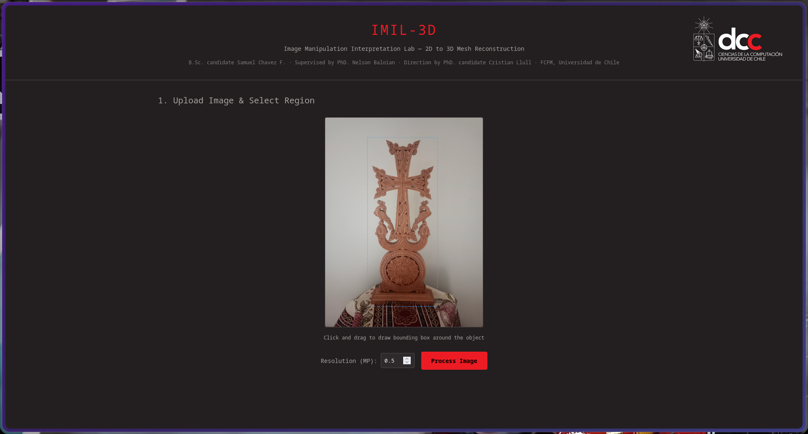
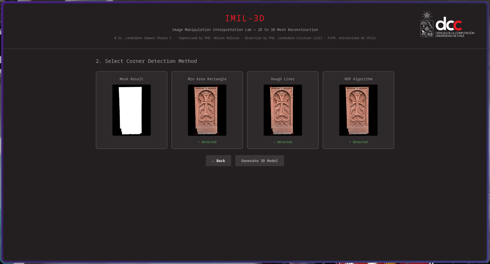
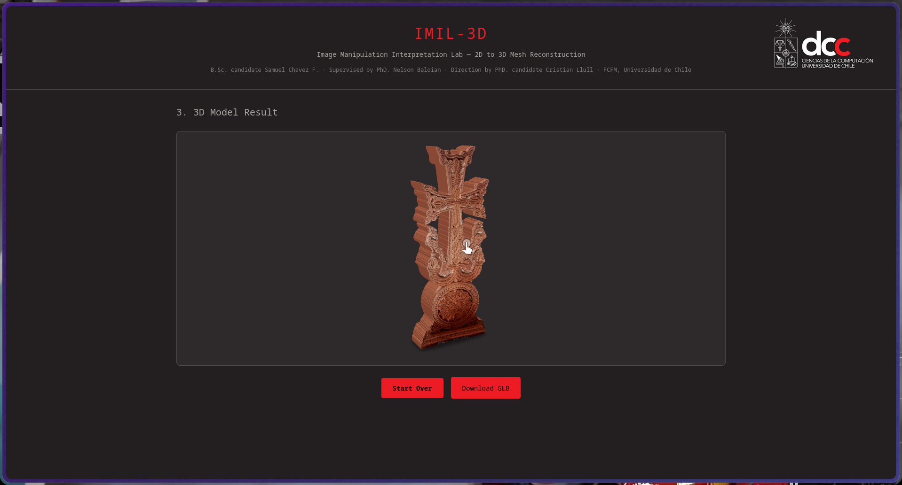

# IMIL-3D: Image Manipulation Interpretation Lab 3D

> _A Python framework for converting single 2D images into textured 3D mesh reconstructions._

Welcome to 3D IMIL a lab created by B.Sc. Candidate Samuel Chavez F. in under supervision by PhD. Nelson Baloian and inspired and direction of PhD. Student Cristian Llull, FCFM, Universidad de Chile.

The module lab presents the foundations of working with single images in Python to streamline the process of interpreting a static image and infere depth to recreate good fidelity 3D estimations of the object using different methods initially in the scope of culture presevation and digitalization of Khachkars

Next is presented a interactive documentation of what you can find in this lab, in conjuction with this docs there is main as example pipeline end to end that uses the methods to get a object reconstruction 

## Overview

IMIL-3D provides tools for working with single images in Python to interpret static images, infer depth, and reconstruct high-fidelity 3D estimations. Initially developed for cultural preservation and digitalization of [Khachkars](https://en.wikipedia.org/wiki/Khachkar).

📓 See `Core/IMIL_3D_Interactive_Docs.ipynb` for interactive documentation  
📦 See `Core/main.py` for an end-to-end pipeline example

## Web Interface Demo

A lightweight web GUI is included to demonstrate the full reconstruction pipeline interactively.

<p align="center">
  
  
  
</p>

1. Upload an image and draw bounding box around your object — the system automatically detects the object itself. 
2. Select from three corner detection algorithms to refine boundaries 
3. View and interact with the final reconstructed 3D mesh 

---

## Installation

### Core Lab

```bash
pip install -r requirements.txt
```

Additionally:
- Install [PyTorch](https://pytorch.org/get-started/locally/) for your device (CPU/CUDA)
- Download a [SAM 2.1](https://github.com/facebookresearch/sam2) checkpoint (e.g. `hiera_base_plus`) into `checkpoints/`

### Web GUI

```bash
pip install -r web/requirements.txt
python web/web_api.py
```

Then open → http://localhost:8000
